# Docs

_How to use GitHub_

## Prep

Download GH Desktop en installeer het. Kun je best zelf.

## Uitleg

  
Clonen

  
  ### Stap 1

  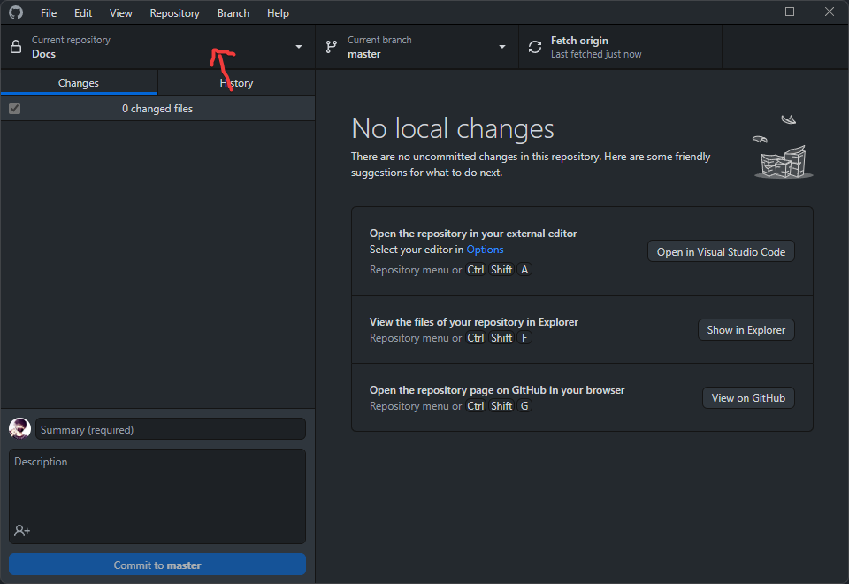
  
  ### Stap 2

  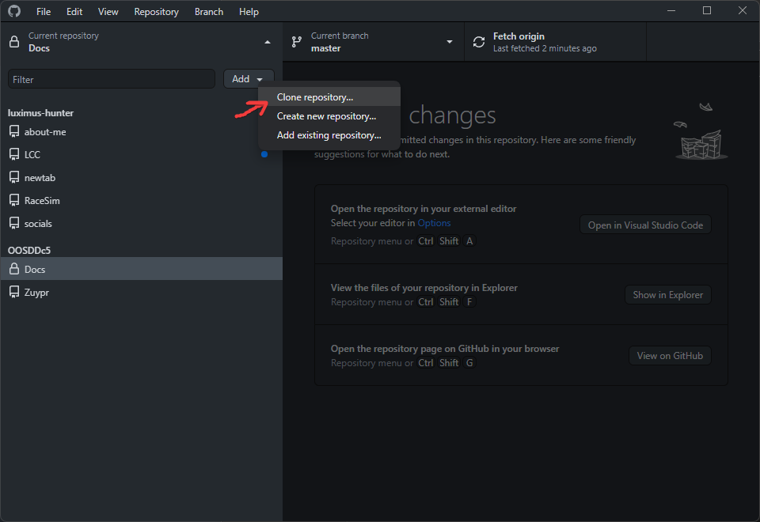
  
  ### Stap 3

  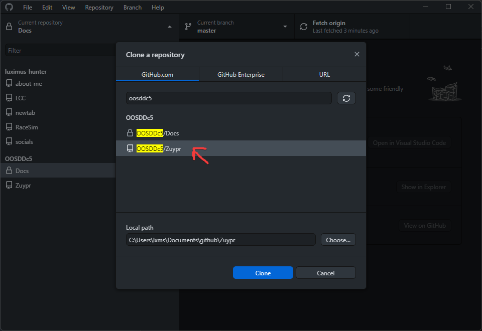
  
  ### Stap 4

  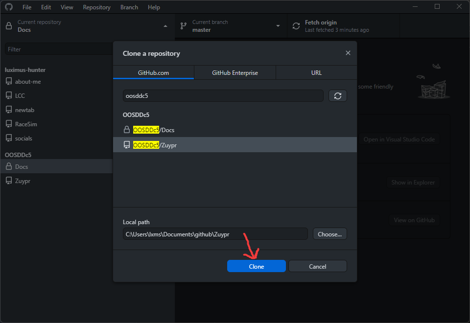

  
Fetch & Pull

  
  ### Stap 1

  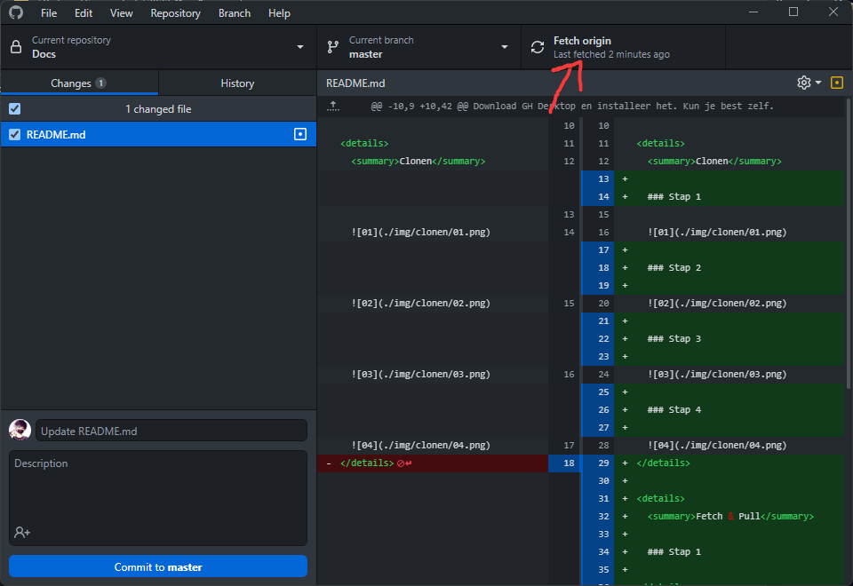

  
Nieuwe Usecase

  
  ### Stap 1

  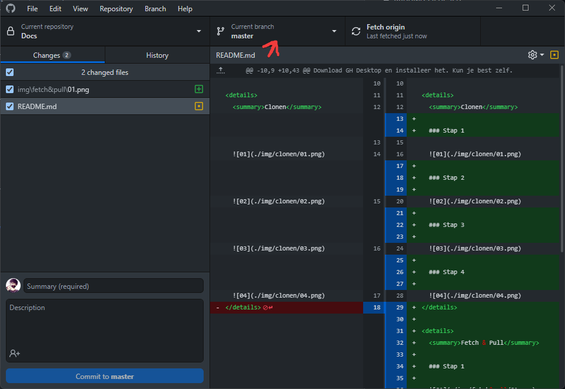
  
  ### Stap 2

  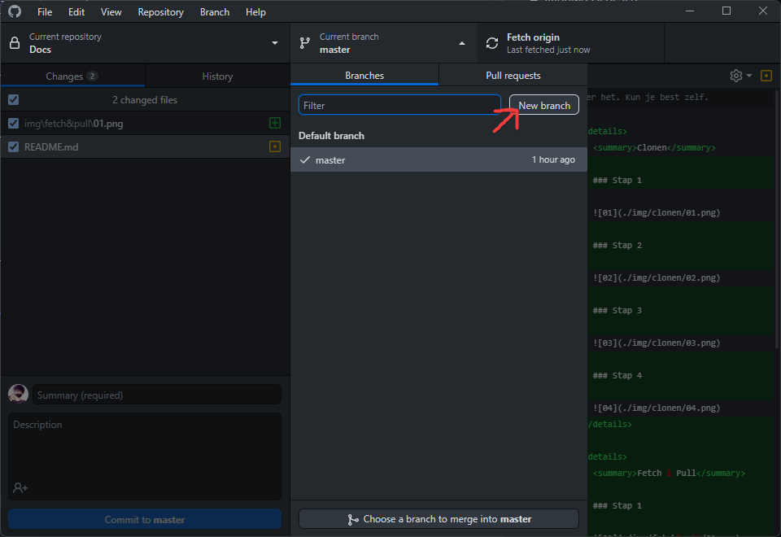
  
  ### Stap 3

  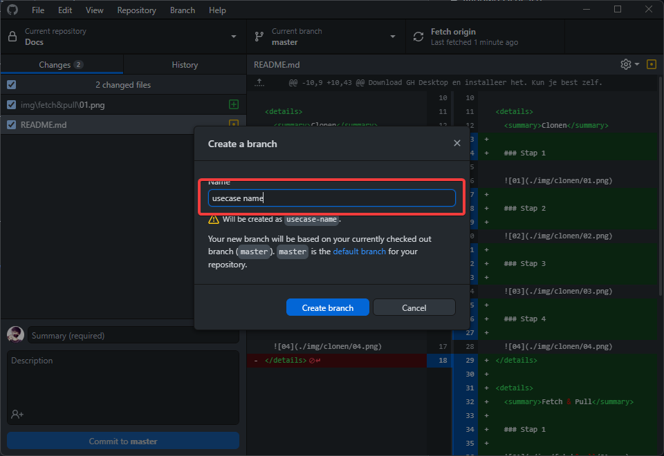
  
  ### Stap 4

  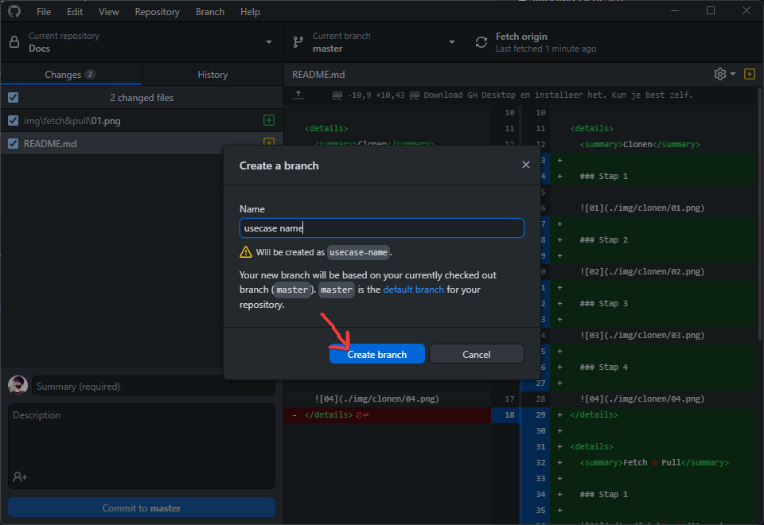
  
  ### Stap 5

  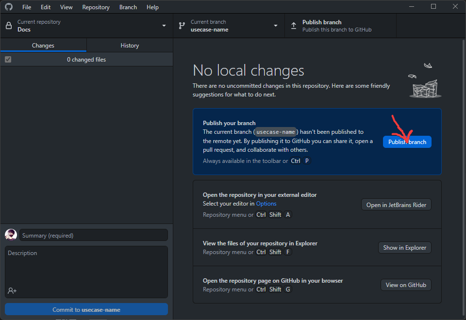

  
Pull Request

  
  ### Stap 1

  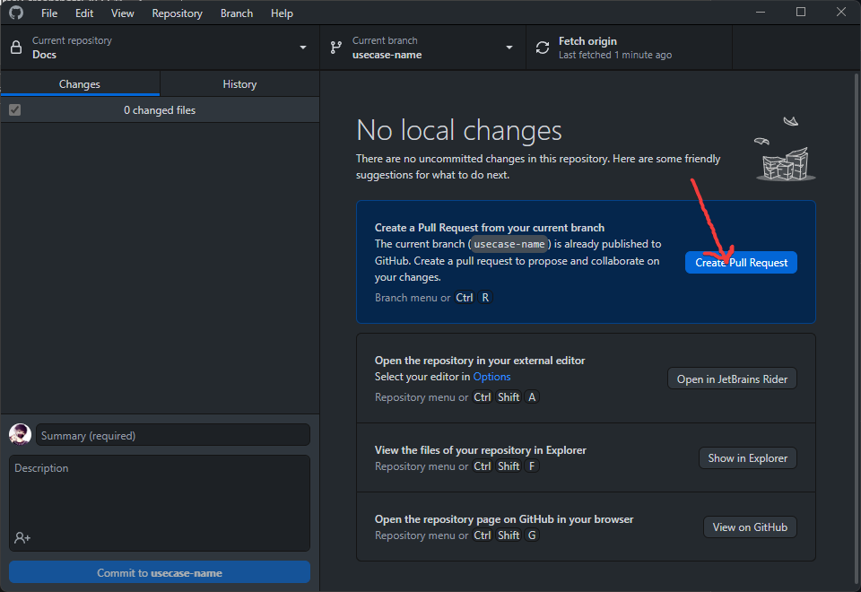
  
  ### Stap 2

  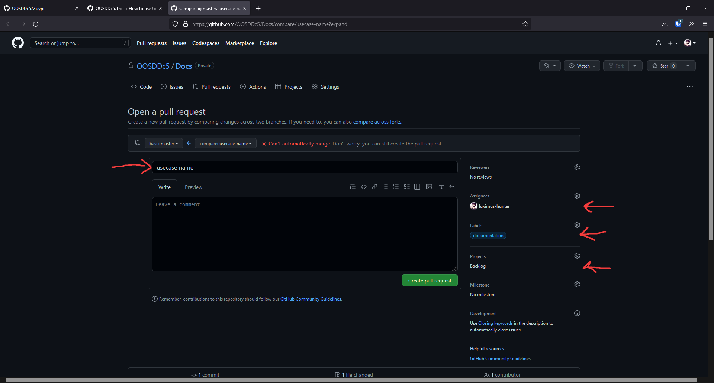
  
  ### Stap 3

  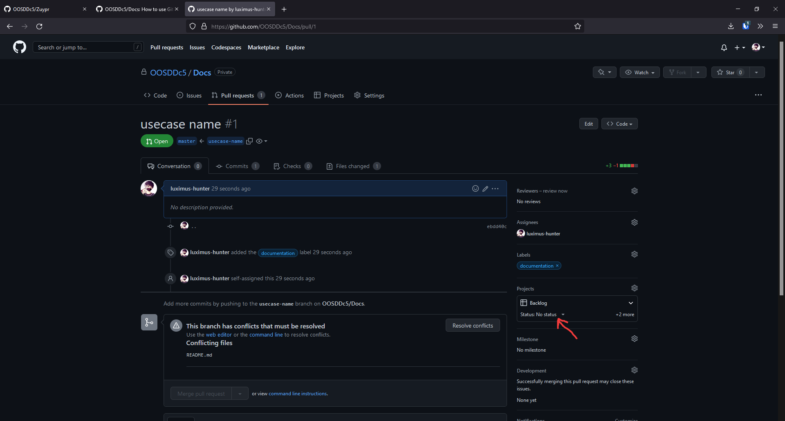
  
  ### Stap 4

  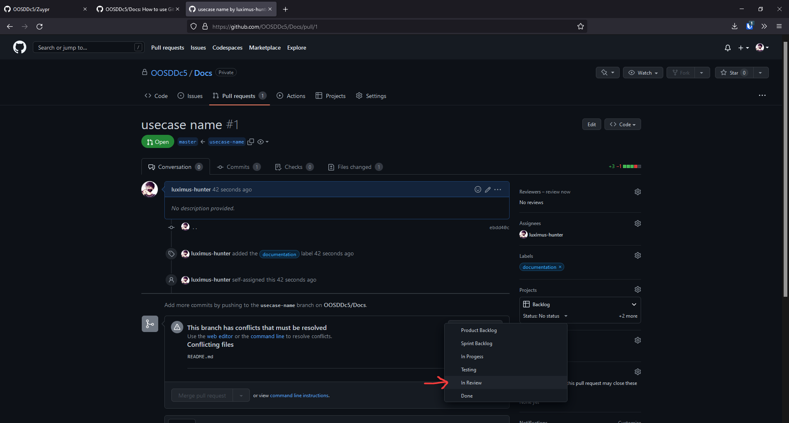

  
Merging

  
  ### Stap 1

  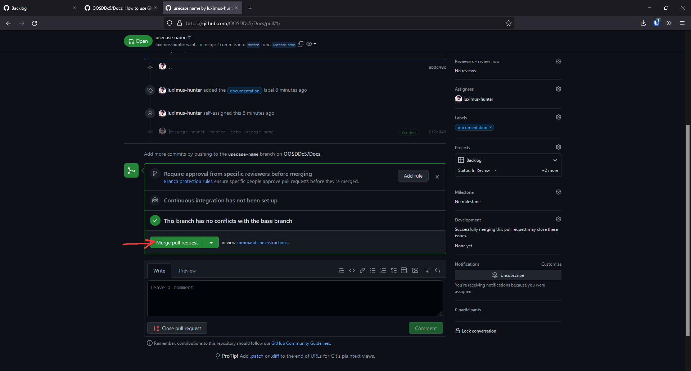

